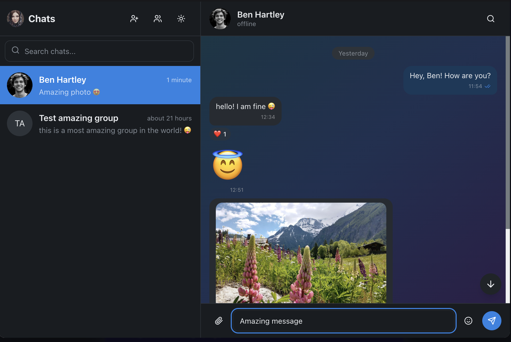

# quick-chat-react


Drop-in real-time chat for React apps built on **[Supabase](https://supabase.com)**.

[](https://quick-chat-react.vercel.app)

## Preview



## Installation

```bash
# npm
npm install quick-chat-react

# yarn
yarn add quick-chat-react

# pnpm
pnpm add quick-chat-react

**Requires Supabase.** If your project uses Firebase, Auth0, or a custom backend, this library is not the right fit.

**Features:** real-time messaging · group conversations · voice messages · file & photo uploads · emoji reactions · read receipts · online status · contact management

---

### Why quick-chat-react?

• ⚡ Add full chat to your app in minutes  
• 🔐 Uses your existing Supabase Auth users  
• 💬 Real-time messaging powered by Supabase Realtime  
• 📁 File uploads, voice messages, reactions, and groups included  
• 🎨 Works with any React UI layout

## Perfect for

- SaaS apps
- Startup MVPs
- Internal team tools
- Community platforms
- Lovable + Supabase projects

## Use as your startup's base

`authMode="built-in"` gives you a complete user infrastructure in minutes — auth, profiles, real-time chat, file storage, and a navbar avatar component with sign out and theme switching. All production-ready on day one.

The **`profiles` table is yours.** The library only reads the columns it needs (`display_name`, `avatar_url`, `bio`, `is_online`, `last_seen`) — anything else you add is invisible to it and fully under your control. Extend it freely:

```sql
ALTER TABLE public.profiles
  ADD COLUMN IF NOT EXISTS plan      TEXT DEFAULT 'free',
  ADD COLUMN IF NOT EXISTS role      TEXT DEFAULT 'member',
  ADD COLUMN IF NOT EXISTS team_id   UUID,
  ADD COLUMN IF NOT EXISTS onboarded BOOLEAN DEFAULT false;
```

Then read your custom fields with your own Supabase client alongside the library — no extra configuration needed. Gate library features by plan, drive onboarding flows from `onboarded`, restrict data by `team_id` via RLS — the library stays out of the way.

**→ Full guide: [Using quick-chat-react as a Startup Base](https://github.com/AndreyKornyusko/quick-chat-react/blob/main/docs/startup-base.md)**

---

## Who it's for

- **Startups** — use built-in auth as your user system and extend the schema for your product
- **Lovable + Supabase projects** — add chat in 10 minutes, no backend changes needed
- Any **React + Supabase** app using email/password, Google, or GitHub auth
- Projects where chat users should be the same as your existing Supabase users

## Compatibility

| Your setup | Supported |
|---|---|
| Fresh Supabase project | ✅ Yes |
| Supabase Auth (email/password) | ✅ Yes |
| Supabase OAuth (Google, GitHub) | ✅ Yes |
| Lovable + Supabase (no `profiles` table yet) | ✅ Yes |
| Lovable + Supabase (`profiles` table already exists) | ✅ Yes — [use the additive migration](https://github.com/AndreyKornyusko/quick-chat-react/blob/main/docs/lovable-existing-schema.md) |
| Separate Supabase project for chat | ⚠️ Advanced — [see guide](https://github.com/AndreyKornyusko/quick-chat-react/blob/main/docs/advanced-separate-project.md) |
| Firebase / Auth0 / custom auth backend | ❌ Not supported |

---

## Quick Start (10 minutes)

```bash
npm install quick-chat-react
```

```ts
// main.tsx — import once
import "quick-chat-react/style.css";
```

Run the migrations from [`/supabase/migrations/`](https://github.com/AndreyKornyusko/quick-chat-react/tree/main/supabase/migrations) in filename order via Supabase SQL Editor, then:

```tsx
import { QuickChat } from "quick-chat-react";

export default function App() {
  return (
    <QuickChat
      supabaseUrl={import.meta.env.VITE_SUPABASE_URL}
      supabaseAnonKey={import.meta.env.VITE_SUPABASE_ANON_KEY}
    />
  );
}
```

> **Already have a `profiles` table?** (Lovable-generated projects usually do.) Skip the standard migration files and run [`additive-for-existing-profiles.sql`](https://github.com/AndreyKornyusko/quick-chat-react/blob/main/supabase/migrations/additive-for-existing-profiles.sql) instead. See the [Lovable guide](https://github.com/AndreyKornyusko/quick-chat-react/blob/main/docs/lovable-existing-schema.md).

Full step-by-step: [docs/quick-start.md](https://github.com/AndreyKornyusko/quick-chat-react/blob/main/docs/quick-start.md)

---

## Auth Modes

### Built-in auth (library handles login UI)

The library renders its own signup/login screens when the user is not signed in. Best for fresh projects with no existing auth.

```tsx
<QuickChat
  supabaseUrl={import.meta.env.VITE_SUPABASE_URL}
  supabaseAnonKey={import.meta.env.VITE_SUPABASE_ANON_KEY}
  // authMode="built-in" is the default — can be omitted
/>
```

### External auth (pass your existing Supabase session)

Your app already has Supabase Auth. Pass the session tokens and the chat reuses the same logged-in user — no second login.

```tsx
import { QuickChat } from "quick-chat-react";

// After your own supabase.auth.signIn...
const { data: { session } } = await supabase.auth.getSession();

<QuickChat
  supabaseUrl={import.meta.env.VITE_SUPABASE_URL}
  supabaseAnonKey={import.meta.env.VITE_SUPABASE_ANON_KEY}
  authMode="external"
  userData={{
    id: session.user.id,                                    // Supabase UUID — required
    name: session.user.user_metadata.display_name ?? session.user.email,
    avatar: session.user.user_metadata.avatar_url,
    email: session.user.email,
    accessToken: session.access_token,                      // required
    refreshToken: session.refresh_token,                    // required for auto-refresh
  }}
/>
```

Full guide with token refresh, OAuth setup, and profile sync: [docs/external-auth.md](https://github.com/AndreyKornyusko/quick-chat-react/blob/main/docs/external-auth.md)

---

## Detailed Guides

| Guide | When to use |
|---|---|
| [Quick Start](https://github.com/AndreyKornyusko/quick-chat-react/blob/main/docs/quick-start.md) | Fresh project, built-in auth, Lovable from scratch |
| [Startup Base](https://github.com/AndreyKornyusko/quick-chat-react/blob/main/docs/startup-base.md) | Extending profiles, onboarding, plan gating, team isolation |
| [External Auth](https://github.com/AndreyKornyusko/quick-chat-react/blob/main/docs/external-auth.md) | Already have Supabase Auth, want same-user chat |
| [Lovable Existing Schema](https://github.com/AndreyKornyusko/quick-chat-react/blob/main/docs/lovable-existing-schema.md) | Lovable project with existing `profiles` table |
| [Separate Supabase Project](https://github.com/AndreyKornyusko/quick-chat-react/blob/main/docs/advanced-separate-project.md) | Complete data isolation, separate billing |

---

## `ChatButton` component

A floating or inline button that shows the unread message count badge. Useful as an entry point to open a chat modal.

Pass `userData` with session tokens and the badge fetches and updates the unread count automatically via Supabase Realtime. `accessToken` and `refreshToken` are both required — Supabase Row Level Security rejects queries without a valid session.

```tsx
import { ChatButton } from "quick-chat-react";

// Get the session from your own Supabase client after sign-in
const { data: { session } } = await supabase.auth.getSession();

<ChatButton
  supabaseUrl={import.meta.env.VITE_SUPABASE_URL}
  supabaseAnonKey={import.meta.env.VITE_SUPABASE_ANON_KEY}
  userData={{
    id: session.user.id,
    name: session.user.user_metadata.display_name ?? session.user.email,
    accessToken: session.access_token,    // required — authenticates the Supabase query
    refreshToken: session.refresh_token,  // required — prevents session expiry after 1 h
  }}
  onClick={() => setIsChatOpen(true)}
/>
```

Full usage and customization guide: [docs/ChatButton.md](https://github.com/AndreyKornyusko/quick-chat-react/blob/main/docs/ChatButton.md)

---

## `UserAvatar` component

A user avatar button for your navbar or header. When using `authMode="built-in"`, it detects the current session automatically — no extra wiring needed. On click it shows a dropdown with profile info, theme switcher (Light / Dark / System), and Sign out.

```tsx
import { QuickChat, UserAvatar } from "quick-chat-react";

const url = import.meta.env.VITE_SUPABASE_URL;
const key = import.meta.env.VITE_SUPABASE_ANON_KEY;

export default function App() {
  return (
    <>
      <nav className="flex items-center justify-between px-6 h-14 border-b">
        <span className="font-semibold">My App</span>
        <UserAvatar
          supabaseUrl={url}
          supabaseAnonKey={key}
          authMode="built-in"
          showName
        />
      </nav>
      <QuickChat supabaseUrl={url} supabaseAnonKey={key} authMode="built-in" />
    </>
  );
}
```

Full usage and customization guide: [docs/UserAvatar.md](https://github.com/AndreyKornyusko/quick-chat-react/blob/main/docs/UserAvatar.md)

---

## Contact search

The chat sidebar includes a **Contacts** button (person+ icon) with two tabs:

- **My Contacts** — existing contacts with "Start chat" and "Remove" actions
- **Search** — type 2+ characters to find users by display name, then add them or start a chat directly

For a user to appear in search results they must have a `profiles` row in your Supabase database. This row is created automatically by a trigger whenever a Supabase auth user is created.

| Auth mode | What you need to do |
|-----------|---------------------|
| `built-in` | Nothing — profiles are created when users sign up through the built-in UI |
| `external` | Provision each user via the Admin API (`createUser`) as shown above — the trigger fires and creates the profile automatically |

---

## Props reference

### `<QuickChat>`

| Prop | Type | Default | Description |
|---|---|---|---|
| `supabaseUrl` | `string` | — | **Required.** Your Supabase project URL. |
| `supabaseAnonKey` | `string` | — | **Required.** Your Supabase anon/public key. |
| `authMode` | `"built-in" \| "external"` | `"built-in"` | Auth flow to use. |
| `userData` | `UserData` | — | Required when `authMode="external"`. |
| `theme` | `"light" \| "dark" \| "system"` | `"system"` | UI color theme. |
| `showGroups` | `boolean` | `true` | Show group conversations in the sidebar. |
| `allowVoiceMessages` | `boolean` | `true` | Enable voice message recording. |
| `allowFileUpload` | `boolean` | `true` | Enable file and photo uploads. |
| `allowReactions` | `boolean` | `true` | Enable emoji reactions on messages. |
| `showOnlineStatus` | `boolean` | `true` | Show green online indicator dots. |
| `showReadReceipts` | `boolean` | `true` | Show read receipt checkmarks. |
| `height` | `string` | `"600px"` | Container height (any CSS value). |
| `width` | `string` | `"100%"` | Container width (any CSS value). |
| `onUnreadCountChange` | `(count: number) => void` | — | Fires when unread count changes. |
| `onConversationSelect` | `(id: string) => void` | — | Fires when a conversation is selected. |

### `UserData`

| Field | Type | Required | Description |
|---|---|---|---|
| `id` | `string` | Yes | User's UUID. Must match `profiles.id` in Supabase. |
| `name` | `string` | Yes | Display name shown in chat. |
| `avatar` | `string` | No | Avatar image URL. |
| `email` | `string` | No | User's email address. |
| `description` | `string` | No | Short bio or role shown on profile. |
| `accessToken` | `string` | Yes (external mode) | Supabase JWT. Required for `authMode="external"`. |

### `<ChatButton>`

| Prop | Type | Default | Description |
|---|---|---|---|
| `supabaseUrl` | `string` | — | **Required.** |
| `supabaseAnonKey` | `string` | — | **Required.** |
| `userData` | `UserData` | — | Needed to fetch unread count in external auth scenarios. |
| `onClick` | `() => void` | — | Click handler (e.g. open your chat modal). |
| `href` | `string` | — | Navigate to URL on click instead of `onClick`. |
| `position` | `"bottom-right" \| "bottom-left"` | `"bottom-right"` | Screen position (floating mode only). |
| `floating` | `boolean` | `true` | Fixed floating button. Set `false` for inline use. |
| `unreadCount` | `number` | — | Override unread count badge manually. |
| `size` | `"sm" \| "md" \| "lg"` | `"md"` | Button size. |
| `badgeColor` | `string` | — | Badge background color (CSS color value). |
| `buttonColor` | `string` | — | Button background color (CSS color value). |
| `iconColor` | `string` | — | Icon color (CSS color value). |
| `icon` | `ReactNode` | — | Custom icon element. |
| `label` | `string` | `"Open chat"` | Accessible aria-label for the button. |

### `<UserAvatar>`

| Prop | Type | Default | Description |
|---|---|---|---|
| `supabaseUrl` | `string` | — | **Required.** |
| `supabaseAnonKey` | `string` | — | **Required.** |
| `authMode` | `"built-in" \| "external"` | `"built-in"` | Auth mode. `"built-in"` detects session automatically. |
| `userData` | `UserData` | — | Pass in external auth mode. |
| `showName` | `boolean` | `false` | Show display name next to the avatar. |
| `nameMaxLength` | `number` | `20` | Max characters before name is truncated with `…`. |
| `size` | `"sm" \| "md" \| "lg"` | `"md"` | Avatar size — `sm` 32 px, `md` 40 px, `lg` 48 px. |
| `floating` | `boolean` | `false` | Fixed floating element. Default is inline. |
| `position` | `"top-right" \| "top-left" \| "bottom-right" \| "bottom-left"` | `"top-right"` | Screen position (floating mode only). |
| `onThemeChange` | `(theme: string) => void` | — | Called when user picks a theme. |
| `onProfileClick` | `() => void` | — | Replace built-in profile dialog with custom handler. |
| `onLogout` | `() => void` | — | Called after sign-out completes (e.g. redirect to login). |
| `onLogin` | `() => void` | — | Called when "Sign in" is clicked (no active session). |
| `className` | `string` | — | Extra CSS classes on the trigger element. |
| `style` | `CSSProperties` | — | Inline styles on the trigger element. |

---

## Security notes

- The **anon key** is safe to expose on the frontend. All access is controlled by Supabase Row Level Security (RLS) policies — users can only read and write their own data.
- The **service role key** must never be exposed on the frontend. Use it only in your backend to generate access tokens.
- In external mode, `accessToken` grants the user access to Supabase. Treat it like a session token — send it over HTTPS, don't log it, and expire it appropriately.
